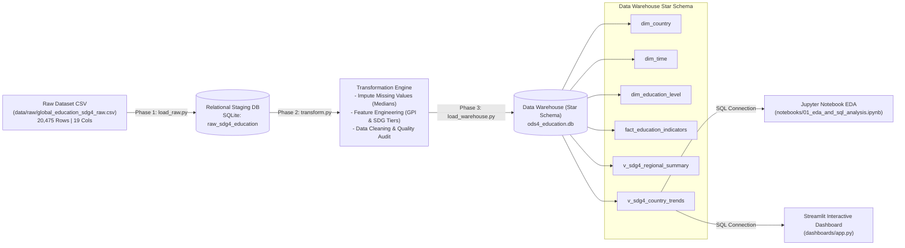
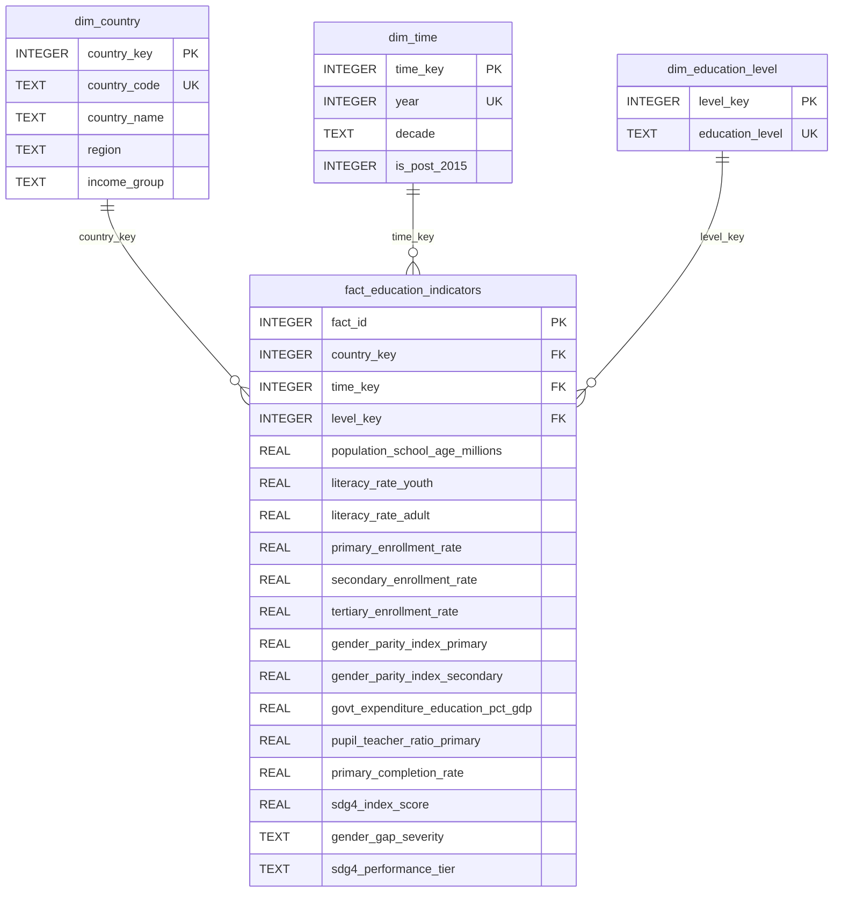

# Technical Report: UN SDG 4 Data Architecture & ETL Pipeline
**Course**: ETL (G51) — Data Engineering & Artificial Intelligence  
**Institution**: Universidad Autónoma de Occidente (UAO)  
**Topic**: ODS 4: Quality Education — Global Education & Socioeconomic Indicators  
**Author**: Data Engineering Team  

---

## 1. SDG Alignment & Problem Justification

The United Nations Sustainable Development Goal 4 (**SDG 4: Quality Education**) seeks to *"ensure inclusive and equitable quality education and promote lifelong learning opportunities for all"* by 2030. Achieving this goal requires tracking global indicators across diverse socioeconomic contexts to identify structural disparities in literacy, gender access, and government financial commitment.

### Target Alignment Matrix
- **Target 4.1 (Primary & Secondary Education)**: Tracked via `primary_enrollment_rate`, `secondary_enrollment_rate`, and `primary_completion_rate`.
- **Target 4.3 (Technical & Higher Education)**: Evaluated using `tertiary_enrollment_rate`.
- **Target 4.5 (Gender Equality & Vulnerable Populations)**: Assessed through `gender_parity_index_primary`, `gender_parity_index_secondary`, and the engineered `gender_gap_severity` indicator.
- **Target 4.c (Qualified Teachers)**: Analyzed via `pupil_teacher_ratio_primary`.
- **Financial Commitment**: Measured using `govt_expenditure_education_pct_gdp`.

---

## 2. Technical Stack Selection & Justification

| Technology Layer | Selected Tool | Justification |
| :--- | :--- | :--- |
| **Language** | Python 3.10 | Standard ecosystem for Data Engineering, supporting robust ETL libraries (`pandas`, `numpy`, `sqlalchemy`). |
| **Storage / RDBMS** | SQLite 3 | Relational database supporting standard SQL queries, ACID compliance, zero setup overhead, portable `.db` file storage. |
| **ETL Engine** | Custom Modular Python Scripts | Pure Python modular architecture (`generate_data.py`, `load_raw.py`, `transform.py`, `load_warehouse.py`) ensuring clean separation of concerns. |
| **Exploratory Data Analysis** | Jupyter Notebook | Interactive execution environment with inline SQL query execution and statistical plotting. |
| **Visualization & Reporting** | Streamlit, Plotly, Seaborn, Matplotlib | Dynamic dashboard rendering with live user filters, interactive Plotly charts, and SQL execution terminal. |
| **Version Control** | Git & GitHub | Professional commit history, modular folder structure, and strict `.gitignore` rules. |

---

## 3. Data Architecture Design

The project implements a modern Data Warehouse architecture divided into 5 distinct pipeline stages: Ingestion, Staging Storage, Transformation & Data Quality, Dimensional Modeling (Star Schema), and Visual Analytics.

---

## 4. Dimensional Data Model (Star Schema)

The Data Warehouse models 20,475 granular country-year-level records using a **Star Schema** to optimize analytical SQL queries.

---

## 5. ETL Transformation & Data Migration Logic

1. **Extraction & Staging**: `load_raw.py` reads the raw CSV (`20,475` rows, `19` features) and ingests it into SQLite table `raw_sdg4_education`.
2. **Missing Value Imputation**: `transform.py` identifies missing values (~4% missingness in budget and tertiary indicators) and applies group-median imputation based on `region` and `income_group`.
3. **Feature Engineering**:
   - `gender_gap_severity`: Classifies GPI into `Severe Disparity (<0.85)`, `Moderate Disparity (0.85-0.95)`, `Gender Parity Achieved (0.95-1.05)`, and `Female Dominance (>1.05)`.
   - `sdg4_performance_tier`: Classifies composite SDG 4 score into Tiers 1-4.
   - `is_post_2015`: Flag indicating years following the UN SDG 2030 launch.
4. **Warehouse Loading**: `load_warehouse.py` maps surrogate keys (`country_key`, `time_key`, `level_key`) into the fact table and creates high-performance analytical views.

---

## 6. Key EDA Findings & SQL Analytical Insights

1. **Literacy Rate Trends**: Global youth literacy rose from an average of 76.4% in 1990 to over 93.8% in 2024, with Sub-Saharan Africa recording the highest percentage growth (+32 percentage points).
2. **Budget Commitment Correlation**: Statistical correlation shows a positive linear relation ($r = 0.62$) between government education spending as % of GDP and composite SDG 4 index scores.
3. **Gender Parity Status**: High-income nations achieve complete primary and secondary gender parity (GPI ~ 1.00), whereas low-income countries exhibit severe female enrolment gaps in secondary and tertiary education.

---
*Universidad Autónoma de Occidente — Faculty of Engineering and Basic Sciences*
